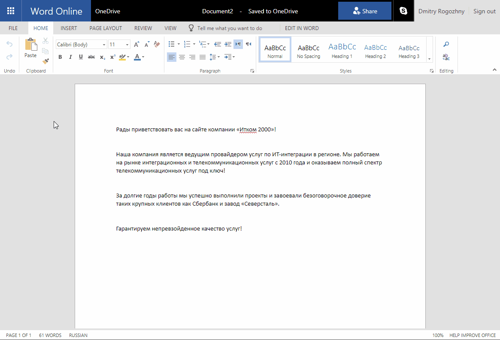

# Glvrd Add-in
Microsoft Word Add-in that helps to find problems in Russian-language texts: fillers, journalese, and corporate jargon. Works in desktop Microsoft Word versions and in Office 365.
It uses https://glvrd.ru as a proofreading service.



# How to Run Project Locally
1. Clone the repository:
``` bash
$ git clone https://github.com/dmitryrogozhny/glvrd-addin-2.git
$ cd glvrd-addin-2
```

2. Install dependent packages:
``` bash
$ npm install
```

3. Run addin locally
``` bash
$ npm run start
```

`dist` folder will be created with the compiled addin.


4. Open Microsoft Office on a desktop or in a browser. In the `Insert` tab select `Office Add-Ins`. In the opened dialog click on `Manage My Add-ins` and select `Upload My Add-in`. Provide a path to a development version of the manifest file in `./manifest/manifest.dev.xml`. Add-in button will become available in the `Review` tab. Click it to activate addin.

5. Select some Russian-language text to run a check on it.


# Structure of Project
The project contains the following folders:
- **config** stores Webpack configuration
- **manifext** contains Office Add-in manifests
- **src** source code of the application
    - in the root folder of `src` there is a TypeScript part of the application. It loads Elm app and provides communication with Office and Glvrd service.
    - **app** folder contains the Elm part that runs the main logic of the app.
    - **css** contains css file and dependent assets.
    - **static** stores static about pages and icons for the Add-in.
